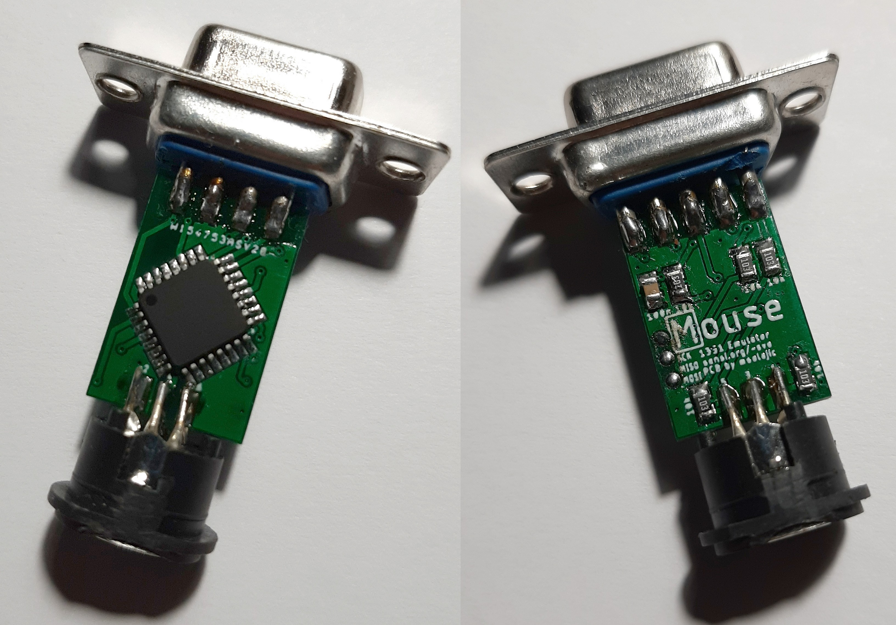

# mouse_pcb
PCB for http://sensi.org/~svo/[m]ouse/
Project is also on GitHub, https://github.com/svofski/mouse1351

I cannot find the license information for the original repository, so this is licensed with the Unlicense, or "do whatever you want with it" license.

This is a quick release for CRX 2020, more detailed description and BOM to follow shortly.

